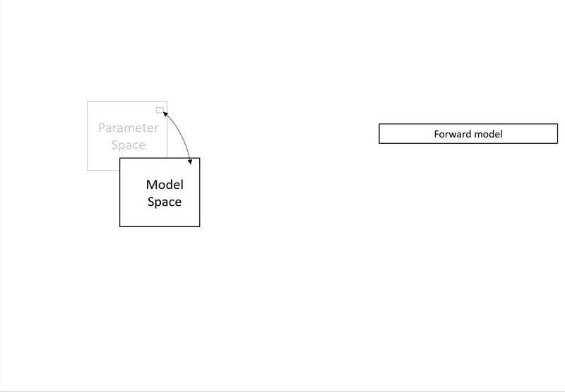
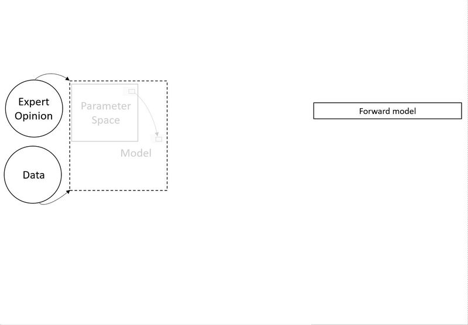
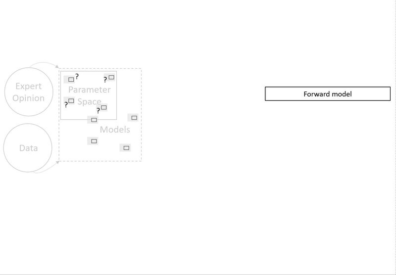

***

# A model

> We begin with the key question: what is a model?  

We define a model as a collection of [initial and boundary conditions](terms.html#term-1), hydrogeologic structures and hydraulic or chemical property values that have been collected in an algorithm that can make quantitative forecasts as a means to test underlying hypotheses. We use the term [parameter](terms.html#term-2) to refer to any adjustable characteristic of a model. With this general definition, it is possible to consider any of the model characteristics listed above as model parameters. A model is then, simply, a unique combination of parameter values. The space of all possible values of all model parameters constitutes parameter space. In general, parameter space is continuous: there are infinitely many values of each parameter within the imposed limits.

# Paramater/Model spaces

> Then we recognize that parameter space maps onto and defines model space.

The collection of all possible models constitutes model space. But, a model is a discrete realization of one point in parameter space. While the space of possible models is infinite, we only ever construct (realize) a limited number of models to the point that they can make forecasts. [Parameter space](terms.html#term-3) has as many dimensions as independent defined parameters. If we assume, for simplicity, that every parameter is defined for every model, then model space maps 1:1 onto parameter space. Despite this 1:1 mapping, parameter space and model space are not functionally equivalent. The term parameter space is more useful in describing which characteristics of a model impact specific forecasts. The term model space is more useful in describing how models can be clustered based on their forecasts.

# Formative data

> Initially, data and experience guide the definition of parameter/model space.

The simplest view of the model building process leads to a single, deterministic model. In this view, parameter space is informed by existing site-specific information (data) and general information (expert opinion)that can be transferred to the site. These are filtered through a modeler’s insight to formulate a conceptual model of the hydrogeologic system. This conceptual model is translated into a mathematical representation, for which parameter values must be defined. The goal is to develop a quantitative representation of the system with minimal artifacts due to mathematical translation and parameter population. We generally iterate through three model building steps multiple times and each step is often a collaborative effort. There is growing recognition that all hydrologic models include uncertain elements. Books have been written on the topic of uncertainty. For this discussion, we will restrict uncertainty to two types: known and unknown. Known uncertainties stem from uncertainties in the values of the model parameters. These uncertainties reflect the fact that most of our model parameter values are not known exactly and some are unknowable. Unknown uncertainties arise from parameters (and related processes) that we did not include in parameter space. To address these uncertainties, we need to propose additional dimensions to parameter/model space. The simplest approach to uncertainty analysis defines the known uncertainty in the immediate neighborhood of a deterministic model. This is explored by perturbing the parameter values and examining the impacts on forecasts. Sampling the region around the best fitting model to describe uncertainty is computationally efficient. However, this approach is predicated on the assumption that the deterministic model is essentially correct, but that its predictions are uncertain due to relatively small uncertainties in the parameter values.

