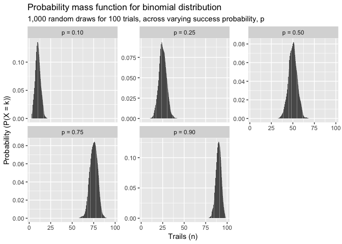

Google DS interview prep
================

  - [Collecting Data](#collecting-data)
      - [Types of Bias](#types-of-bias)
      - [Data collection strategies](#data-collection-strategies)
      - [Types of Studies](#types-of-studies)
      - [Simpson’s paradox](#simpsons-paradox)
      - [Variables](#variables)
      - [Principles of Experimental
        Design](#principles-of-experimental-design)
  - [Probability](#probability)
      - [Set notation](#set-notation)
          - [Set operations](#set-operations)
          - [Conditional probability](#conditional-probability)
          - [Independent events](#independent-events)
          - [Review](#review)
          - [Bayes Theorem](#bayes-theorem)
  - [Probability Distributions](#probability-distributions)
      - [Expected value and variance of a discrete random
        variable](#expected-value-and-variance-of-a-discrete-random-variable)
      - [Binomial random variables](#binomial-random-variables)
          - [Binomial distribution](#binomial-distribution)
          - [Binomial probability](#binomial-probability)
      - [The Normal Distribution](#the-normal-distribution)
      - [t-distribution](#t-distribution)
      - [Chi-squared distribution](#chi-squared-distribution)
      - [F-distribution](#f-distribution)
      - [Sampling distribution](#sampling-distribution)
      - [Normal Approximation to the
        Binomial](#normal-approximation-to-the-binomial)
  - [Confidence intervals](#confidence-intervals)
      - [Inference](#inference)
      - [Estimation and confidence
        intervals](#estimation-and-confidence-intervals)
      - [CI for the population proportion
        (example)](#ci-for-the-population-proportion-example)
      - [t-distribution](#t-distribution-1)
  - [Hypothesis Testing](#hypothesis-testing)
      - [Power](#power)
      - [Hypothesis Testing for one-sample proportion and one-sample
        mean](#hypothesis-testing-for-one-sample-proportion-and-one-sample-mean)
  - [Comparing two polulation
    parameters](#comparing-two-polulation-parameters)
      - [A/B testing](#ab-testing)
      - [Confidence intervals](#confidence-intervals-1)
  - [Statistical Learning](#statistical-learning)
      - [Supervised v Unsupervised
        learning](#supervised-v-unsupervised-learning)
      - [Bias-Variance tradeoff](#bias-variance-tradeoff)
  - [Linear Regression](#linear-regression)
      - [Simple linear regression](#simple-linear-regression)
      - [Multiple linear regression](#multiple-linear-regression)
      - [Regression considerations](#regression-considerations)
  - [Classification](#classification)
      - [Logistic regression](#logistic-regression)
      - [Discriminant Analysis](#discriminant-analysis)
      - [KNN](#knn)
  - [Resampling methods](#resampling-methods)
      - [Cross-validation](#cross-validation)
      - [Bootstrap](#bootstrap)
  - [Linear model selection and
    Regularization](#linear-model-selection-and-regularization)
      - [Subset selection](#subset-selection)
      - [Shrinkage methods](#shrinkage-methods)
      - [Dimension reduction methods](#dimension-reduction-methods)
      - [Considerations in higher
        dimensions](#considerations-in-higher-dimensions)
  - [Beyond linearity](#beyond-linearity)
      - [Polynomial regression](#polynomial-regression)
      - [Step functions](#step-functions)
      - [Basis functions](#basis-functions)
      - [Regression Splines](#regression-splines)
      - [Smoothing splines](#smoothing-splines)
      - [Local regression](#local-regression)
      - [Generalized additive models
        (GAMs)](#generalized-additive-models-gams)
  - [Tree based methods](#tree-based-methods)
      - [Classification and regression trees
        (CART)](#classification-and-regression-trees-cart)
      - [Bagging, Random Forests,
        Boosting](#bagging-random-forests-boosting)
  - [Support Vector Machines](#support-vector-machines)
      - [Maximal Margin Classifier](#maximal-margin-classifier)
      - [Support Vector Classifier](#support-vector-classifier)
      - [Support Vector Machines (SVMs)](#support-vector-machines-svms)
      - [SVMs with more than 2 classes](#svms-with-more-than-2-classes)
  - [Unsupervised Learning](#unsupervised-learning)
      - [Principal Components Analysis
        (PCA)](#principal-components-analysis-pca)
      - [Clustering methods](#clustering-methods)
  - [Misc topics](#misc-topics)
      - [Spatial data analysis](#spatial-data-analysis)
      - [Interpolation](#interpolation)
      - [MCMC](#mcmc)
      - [Time series analysis](#time-series-analysis)
      - [bash](#bash)
      - [Git](#git)
      - [R](#r)
  - [Additional resources](#additional-resources)
  - [Motivation](#motivation)

``` r
library(tidyverse)
```

    ## Registered S3 methods overwritten by 'ggplot2':
    ##   method         from 
    ##   [.quosures     rlang
    ##   c.quosures     rlang
    ##   print.quosures rlang

    ## Registered S3 method overwritten by 'rvest':
    ##   method            from
    ##   read_xml.response xml2

    ## ── Attaching packages ─────────────────── tidyverse 1.2.1 ──

    ## ✔ ggplot2 3.1.1     ✔ purrr   0.3.3
    ## ✔ tibble  2.1.1     ✔ dplyr   0.8.3
    ## ✔ tidyr   1.0.0     ✔ stringr 1.4.0
    ## ✔ readr   1.3.1     ✔ forcats 0.4.0

    ## ── Conflicts ────────────────────── tidyverse_conflicts() ──
    ## ✖ dplyr::filter() masks stats::filter()
    ## ✖ dplyr::lag()    masks stats::lag()

Topic hierarchy for x:

1.  What is x in both technical and non-technical terms?  
2.  Why is x relevant to data science, or at Google specifically?
3.  What are the assumptions of x?  
4.  What is the math behind x?  
5.  Can you implement x in code?

# Collecting Data

## Types of Bias

Three types of bias in data collection:

1.  **non-response bias**: a large proportion of those sampled do not
    participate/respond (e.g., you get a 20% completion rate on a
    survey)
2.  **response bias**: when those that respond do not respond truthfully
    (e.g., they say what they think the researcher wants to hear)  
3.  **selection bias**: when the sample population doesn’t reflect the
    true population (e.g., you’re studying domestic well properties, but
    your sample includes both domestic wells and agricultural supply
    wells). Another example of selection bias that relates to 1. is that
    the small proportion that responds to a survey may be a
    self-selecting group, and thus may reflect not reflect the true
    population.

All forms of bias may or may not be observable.

## Data collection strategies

Furthermore, we can sample based on probability or not:

Probability-based sampling:

1.  simple random sample: randomly sample from a population  
2.  stratified random sample: sample equally from strata (e.g., sex,
    age, geographic region)
3.  cluster sample: randomly sample clusters, (e.g., to find salary of
    professors at a school, randomly sample departments, and analyze
    salaries in those clusters)

<!-- end list -->

``` r
# table of people giving age and height
d <- tibble(age    = sample(c(20,30,40),   1000, replace = TRUE),
            height = sample(c(50,60),      1000, replace = TRUE),
            gender = sample(c("M","F"),    1000, replace = TRUE),
            group  = sample(LETTERS[1:10], 1000, replace = TRUE))

# simple random sample of 100 individuals (rows) from d
d[sample(1:1000, 100, replace = FALSE), ]
```

    ## # A tibble: 100 x 4
    ##      age height gender group
    ##    <dbl>  <dbl> <chr>  <chr>
    ##  1    20     50 F      J    
    ##  2    40     60 M      A    
    ##  3    40     60 M      C    
    ##  4    30     50 M      D    
    ##  5    30     50 M      B    
    ##  6    40     50 M      C    
    ##  7    40     60 M      H    
    ##  8    20     50 F      G    
    ##  9    20     50 F      C    
    ## 10    40     50 F      I    
    ## # … with 90 more rows

``` r
# stratified random sample: gender is the strata.
# take 50 random samples from each strata.
split(d, d$gender) %>% 
  lapply(., function(x) x[ sample(1:nrow(x), 50 , replace=FALSE) , ] )
```

    ## $F
    ## # A tibble: 50 x 4
    ##      age height gender group
    ##    <dbl>  <dbl> <chr>  <chr>
    ##  1    30     60 F      I    
    ##  2    20     50 F      I    
    ##  3    20     50 F      J    
    ##  4    30     50 F      I    
    ##  5    20     60 F      G    
    ##  6    30     60 F      F    
    ##  7    40     50 F      E    
    ##  8    30     50 F      F    
    ##  9    20     60 F      J    
    ## 10    40     50 F      J    
    ## # … with 40 more rows
    ## 
    ## $M
    ## # A tibble: 50 x 4
    ##      age height gender group
    ##    <dbl>  <dbl> <chr>  <chr>
    ##  1    20     60 M      I    
    ##  2    40     50 M      G    
    ##  3    30     60 M      D    
    ##  4    40     50 M      G    
    ##  5    40     50 M      I    
    ##  6    20     60 M      H    
    ##  7    30     50 M      B    
    ##  8    40     50 M      A    
    ##  9    20     60 M      F    
    ## 10    30     50 M      C    
    ## # … with 40 more rows

``` r
# cluster sample: groups A:E are the cluster. 
filter(d, group %in% LETTERS[1:5]) 
```

    ## # A tibble: 478 x 4
    ##      age height gender group
    ##    <dbl>  <dbl> <chr>  <chr>
    ##  1    20     50 F      A    
    ##  2    40     50 F      A    
    ##  3    30     60 M      B    
    ##  4    40     50 F      D    
    ##  5    30     50 M      D    
    ##  6    30     50 M      B    
    ##  7    20     50 F      B    
    ##  8    20     60 M      B    
    ##  9    30     60 M      D    
    ## 10    40     60 M      D    
    ## # … with 468 more rows

By contrast, non-probability based methods (convenience sampling and
gathering volunteers) can be easier and cheaper, but is not
representative of the population and is suspect to **selection bias**.

Probability based methods can be generalized to the population via
inference.

## Types of Studies

**Observational**: think EDA. You can draw correlations and speculate
about a relationship, but can’t draw cause and effect.

**Experimental**: an experimental study involves random assignment of a
treatment, and can draw cause and effect.

For example, in an **observational study** we might observe a
relationship between a customer being given a 20% off coupon, and how
much they spend at a grocery store. In an **experimental** study, we
would randomly assign coupons to customers and test for significant
differences in spending between the two groups (e.g., does receiving a
coupon make a customer more likely to purchase more?).

## Simpson’s paradox

Relationship between variables within subgroups can be **reversed** when
the subgroups are combined.

## Variables

  - **response** (dependent): what’s of interest  
  - **predictor** (independent): what’s being used to predict  
  - **lurking variable**: a predictor that’s not in the model but that
    influences the response  
  - **confounding variable**: a predictor in the model which relates to
    other predictors, thus impacting the relationship between variables
      - precisely, in the association of **A** and **B**, **X** is a
        confounder if it is associated with **BOTH** **A** and **B**.

A lurking variable, when included in the study may be discovered to have
a confounding effect. Then we’d call it a confounding variable.

## Principles of Experimental Design

The purpose of experimental design is to ensure that effects observed in
an experiment are likely the result the treatment, rather than by caused
by chance.

  - **control**: control for effects due to factors other than the ones
    of primary interest  
  - **randomization**: random distribution of subjects into groups
    prevents selection bias
      - randomization ensures that the distribution of subjects into
        groups is not biased  
  - **replication**: ensure a sufficient number of subjects per group to
    ensure that differences between groups are detectable
      - replication allows for estimating the uncertainty associated
        with the experiment due to uncontrolled variation
      - increases precision  
  - **stratification**: also called “blocking” means taking measurements
    at different times (e.g., morning and night) if it’s anticipated
    that there might be differences among these periods  
  - **representativeness**: are the subjects representative of the
    population you want to study? I.e., is the study free of bias
    (response, non-response, selection)?

If you can, fix a variable. If you can’t, consider stratifying it. If
you can’t fix or stratify the variable, randomize it.

-----

# Probability

Probability of observing event A is
"), and is
bounded by 0 and 1:  \\le 1").

Probability of a not observing A is the compliment,
"), also
called  = 1 - P(A)").

## Set notation

Used to define the sample space
, the set of all
possible outcomes that may occur. For example, consider the
 for tossing two die:

``` r
expand.grid(1:6, 1:6)
```

    ##    Var1 Var2
    ## 1     1    1
    ## 2     2    1
    ## 3     3    1
    ## 4     4    1
    ## 5     5    1
    ## 6     6    1
    ## 7     1    2
    ## 8     2    2
    ## 9     3    2
    ## 10    4    2
    ## 11    5    2
    ## 12    6    2
    ## 13    1    3
    ## 14    2    3
    ## 15    3    3
    ## 16    4    3
    ## 17    5    3
    ## 18    6    3
    ## 19    1    4
    ## 20    2    4
    ## 21    3    4
    ## 22    4    4
    ## 23    5    4
    ## 24    6    4
    ## 25    1    5
    ## 26    2    5
    ## 27    3    5
    ## 28    4    5
    ## 29    5    5
    ## 30    6    5
    ## 31    1    6
    ## 32    2    6
    ## 33    3    6
    ## 34    4    6
    ## 35    5    6
    ## 36    6    6

``` r
nrow(expand.grid(1:6, 1:6)) # number of outcomes in S
```

    ## [1] 36

The set for all possible combinations of two coin flips is 

### Set operations

[union, intersection, compliment,
disjoint](https://online.stat.psu.edu/stat500/lesson/2/2.2)

> **Tip**: read the intersection,
>  as
> *“AND”*.

For the disjoint set ,  = 0").

For the union of events that are not mutually exclusive,  = P(A) + P(B) - P(A \\cap B)").

### Conditional probability

Dependent events:

Probability of A given B,  = P(A \\cap B) / P(B)").

Probability of B given A,  = P(B \\cap A) / P(A)").

Note that usually,  \\ne P(B|A)").

### Independent events

[Two events are independent if either of the following is
true](https://online.stat.psu.edu/stat500/lesson/2/2.6):

 = P(A) \\cdot P(B)")  
 = P(A)") and  = P(B)")

### Review

") = union = probability of
 or
  
") = intersection = probability of
 and
  
") =
compliment = probability of NOT
, i.e.,  + P(C) + ... P(N)")  
") = conditional = probability of
 given


And another rule. Can re-write conditional probability (above) as:

 = P(A|B) \\cdot P(B)")

Another helpful rule:

 = P(A) + P(B) - P(A \\cap B)")

### Bayes Theorem

 = \\frac{P(B|A) P(A)} {P(B|A) P(A) + P(B|A')P(A')}")

-----

# Probability Distributions

Below are examples of discrete (binomial) and continuous (normal)
distributions.

Probability **mass** functions
 **discrete** variables, and  = P(X=x)")

probability **density** functions
 **continuous** variables, and  \\ne P(X=x)")

## Expected value and variance of a discrete random variable

Expected value (mean) is

 = \\sum x_i f(x_i)") where
") is
the probability of event
,
").

Variance () is  = \\sum (x_i - \\bar{x})^2 f(x_i)"), also written as
 - \\bar{x}^2").

Standard deviation
 is
simply the root of the variance.

``` r
# x_i = prior convictions, n = number of prisoners
d <- tibble(xi = 0:4, n = c(80,265,100,40,15))

# probability of event x_i, f(x_i)
d$p <- d$n / sum(d$n)

# expected value = sum(x_i * f(x_i))
ev <- sum(d$xi * d$p) 
ev # 1.29 prior convictions (E doesn't need to be a count)
```

    ## [1] 1.29

``` r
# variance = sum(x_i - EV) * f(x_i)
var <- sum((d$xi - ev)^2 * d$p)
var
```

    ## [1] 0.8659

``` r
# standard deviation 
sd <- sqrt(var)
sd
```

    ## [1] 0.9305375

## Binomial random variables

### Binomial distribution

Special discrete distribution where there are two possible outcomes of a
discrete random variable.

Assumptions (requirements):

1.   identical trials  
2.  Each trial has one of two outcomes (success, failure)  
3.  Success probability , same from trial to trial  
4.  the  trials are
    independent

If these conditions are satisfied, the random variable
 = number of successes
in  trials is a
**binomial random variable** with:

 = np") (mean)

 = np(1-p)") (variance)

)") (standard deviation)

``` r
# consider 5 independent trials with 25% success. 
# probability of 0 successes: P(X=0)
dbinom(x=0, size=5, prob=0.25)
```

    ## [1] 0.2373047

``` r
# probability of 4 or more successes, P(X >= 4)
dbinom(x=4, size=5, prob=0.25) + dbinom(x=5, size=5, prob=0.25)
```

    ## [1] 0.015625

``` r
# same as
sum( dbinom(x=4:5, size=5, prob=0.25) )
```

    ## [1] 0.015625

``` r
# expected value for 5 trails? E(X) = np
5 * 0.25
```

    ## [1] 1.25

``` r
# standard deviation of successes in 5 trails, 
# SD = sqrt(Var), and Var = np(1 - p)
sqrt(5*0.25*0.75)
```

    ## [1] 0.9682458

Consider an experiment with exactly two outcomes (e.g., flipping a
coin), and we call heads success. This is a binomial result. We flip the
coin 100 times (e.g., 100 independent trials, or experiments). If it’s a
fair coin, the probability of success (heads),  0.5. The expected
value is 
100 \* 0.5 = 50. Thus, we expect a normal distribution with mean = 50.

Here we simulate the probability mass function of a binomial
distribution, under varying success probability, and thus expected value
( = np")). `size = 100` indicates 100 independent trials, or
experiments (). `prob =
x` gives the probability of success
 across the independent
trials, which we vary. `n = 1000` means that for each call to `rbinom`
we use 1000 random draws from a binomial distribution with the given
 and
.

Under varying , the
probability mass function is:

``` r
# `rbinom` is somewhat confusing, since the n parameter refers to the 
# number of samples to draw, and the SIZE is actually the n in common
# formulations of the binomial distribution
tibble(`p = 0.10` = rbinom(n=1000, size = 100, prob = 0.10),
       `p = 0.25` = rbinom(n=1000, size = 100, prob = 0.25),
       `p = 0.50` = rbinom(n=1000, size = 100, prob = 0.50),
       `p = 0.75` = rbinom(n=1000, size = 100, prob = 0.75),
       `p = 0.90` = rbinom(n=1000, size = 100, prob = 0.90)) %>% 
  pivot_longer(cols = 1:5, names_to = "p", values_to = "val") %>% 
  ggplot(aes(val)) +
  geom_histogram(stat = "density") +
  facet_wrap(~p, scales = "free_y") +
  labs(title = "Probability mass function for binomial distribution",
       subtitle = "1,000 random draws for 100 trials, across varying success probability, p",
       x = "Trails (n)", y = "Probability (P(X = k))") 
```

    ## Warning: Ignoring unknown parameters: binwidth, bins, pad

<!-- -->

### Binomial probability

The number of possible samples of size
 from a population of
size .

For a binomial random variable:

 = \\left( \\frac{n}{k} \\right) p^k (1-p)^{(n-k)}")

where

 = \\frac{n!}{k!(n-k)!}")

## The Normal Distribution

A special case of a distribution of random variable. For a random
variable ,  = 0") unlike discrete random variables, for which  = \\left( \\frac{n}{k} \\right) p^k (1-p)^{(n-k)}").

Whereas the probability **mass** function of a discrete binomial
function is described by  = f(x)"), the probability **density** function of a continuous
function at a single location is infinitesimally small,  = 0"), and instead is defined as the area under the curve over
an interval bounded by 
and : ").

Given a normal distribution with mean
 and standard
deviation, , the z-score of a value
 is the difference from
the mean divided by the standard deviation, . Z-scores essentially allow us to
standardize any normal distribution to a standard normal distribution,
which then allows us to easily calculate probabilities from known
values. Thus, z-scores are useful for comparing between different
distributions, and related to the **empirical rule**, also called the
**68-95-99.7 rule**: ![\[\\mu - 1\\sigma : \\mu
+ 1\\sigma\]](https://latex.codecogs.com/png.latex?%5B%5Cmu%20-%201%5Csigma%20%3A%20%5Cmu%20%2B%201%5Csigma%5D
"[\\mu - 1\\sigma : \\mu + 1\\sigma]"), ![\[\\mu - 2\\sigma : \\mu
+ 2\\sigma\]](https://latex.codecogs.com/png.latex?%5B%5Cmu%20-%202%5Csigma%20%3A%20%5Cmu%20%2B%202%5Csigma%5D
"[\\mu - 2\\sigma : \\mu + 2\\sigma]"), ![\[\\mu - 3\\sigma : \\mu
+ 3\\sigma\]](https://latex.codecogs.com/png.latex?%5B%5Cmu%20-%203%5Csigma%20%3A%20%5Cmu%20%2B%203%5Csigma%5D
"[\\mu - 3\\sigma : \\mu + 3\\sigma]") = "), "), ") = 68, 95, 99.7 percent of the area under the normal
distribution.

The max possible z score for a data set is }{\\sqrt n}").

The standard normal distribution has 
and ,
"):

``` r
# simulate a standard normal distribution
tibble(x = seq(-4,4,by=0.1), 
       y = dnorm(seq(-4,4,by=0.1), 0, 1)) %>% 
  ggplot(aes(x, y)) +
  geom_line()
```

<!-- -->

## t-distribution

Bell shaped continuous distribution that approaches the normal
distribution with increasingly large degrees of freedom (n-1).

``` r
x <- seq(-10, 10, by = 0.1)
tibble(xindex = x,
       norm  = dnorm(x),
       df1   = dt(x, 1), 
       df5   = dt(x, 5), 
       df10  = dt(x, 10)) %>% 
  pivot_longer(-xindex, names_to = "dof", values_to = "val") %>% 
  mutate(dof = factor(dof, levels = c('norm','df10', 'df5', 'df1'))) %>% 
  ggplot(aes(xindex, val, color = dof)) +
  geom_line() +
  coord_cartesian(xlim = c(-10, 10)) +
  labs(color = "Degrees of \nFreedom")
```

<!-- -->

## Chi-squared distribution

Right-skewed distribution that depends on the degrees of freedom.

``` r
x <- seq(0, 30, by = 0.1)
tibble(xindex = x,
       df1   = dchisq(x, 1), 
       df5   = dchisq(x, 5), 
       df10  = dchisq(x, 10)) %>% 
  pivot_longer(-xindex, names_to = "dof", values_to = "val") %>% 
  mutate(dof = factor(dof, levels = c('df1', 'df5', 'df10'))) %>% 
  ggplot(aes(xindex, val, color = dof)) +
  geom_line() +
  coord_cartesian(xlim = c(0, 20)) +
  labs(color = "Degrees of \nFreedom")
```

<!-- -->

## F-distribution

Right skewed distribution that depends on two parameters: the numerator
and denominator degrees of freedom.

``` r
x <- seq(0, 10, by = 0.05)
tibble(xindex = x,
       df11   = df(x, 1, 1), 
       df15   = df(x, 1, 5), 
       df51   = df(x, 5, 1),
       df1010 = df(x, 10, 10)) %>% 
  pivot_longer(-xindex, names_to = "dof", values_to = "val") %>% 
  mutate(dof = factor(dof, levels = c('df11', 'df15', 'df51', 'df1010'))) %>% 
  ggplot(aes(xindex, val, color = dof)) +
  geom_line() +
  coord_cartesian(xlim = c(0, 10)) +
  labs(color = "Degrees of \nFreedom")
```

<!-- -->

## Sampling distribution

Sample statistics (e.g., SD, mean) of random samples are also random
variables.

A distribution of sample statistics is called a sampling distribution.

Suppose we draw 20 samples from a population and compute their mean,
. We repeat this 1,000 times, generating a distribution of
. This is the sampling
distribution of the sample mean.

``` r
set.seed(7)

# create a population from the standard normal distribution
pop <- rnorm(10000)

# take 20 samples from the population, compute mean, and repeat 1000 times
x <- vector(length = 1000)

for(i in 1:1000) {
  s    <- sample(pop, 30, replace = FALSE)
  x[i] <- mean(s) 
}

tibble(s) %>% 
  ggplot(aes(s)) +
  geom_line(stat="density") +
  labs(title = "Sampling distribution of the sample mean",
       subtitle = "1,000 samples of size 30 from N(0,1)", x = "")
```

<!-- -->

If the population is normally distributed, the sampling distribution of
the sample mean is also normally distributed, no matter the sample size.
The sample mean  has mean
 and standard
deviation equal to standard error,

  
 = SE(\\bar X) = \\frac{\\sigma}{\\sqrt n}")  
Thus the z score of the sample mean is

  
  

If the sample comes from a distribution that is not normally
distributed, the sample mean is still normally distributed if the sample
is large, via the Central Limit Theorem.

If the population is skewed, the sample distribution looks more and more
normal when n gets larger.

``` r
# simulate normal population
pn <- rnorm(10000,0,1)
ggplot(tibble(pn), aes(pn)) + geom_histogram() + labs(title = "N(0,1)")
```

    ## `stat_bin()` using `bins = 30`. Pick better value with `binwidth`.

<!-- -->

``` r
# skewed population - beta distribution
pb <- rbeta(10000, 2, 10) 
ggplot(tibble(pb), aes(pb)) + geom_histogram() + labs(title="Beta(2,10)")
```

    ## `stat_bin()` using `bins = 30`. Pick better value with `binwidth`.

<!-- -->

``` r
# sample extremely small sample sizes from normal population
sample_dist <- function(dist, n, ...) {
  return(sapply(1:10000, function(x) mean(sample(dist, n))))
}

tibble(n2   = sample_dist(pn, n = 2),
       n100 = sample_dist(pn, 100),
       b2   = sample_dist(pb, 2),
       b100 = sample_dist(pb, 100)) %>% 
  pivot_longer(everything(), names_to = "dist", values_to = "sample_mean") %>% 
  ggplot(aes(sample_mean)) +
  geom_line(stat="density") +
  facet_wrap(~dist, scales = "free") +
  labs(subtitle = "Skewed beta population with small sample size -> skewed sampling distribution \nNormal population with small sample size -> normal sampling distribution \nLarge sample size from skewed or normal distribution -> normal sampling distribution")
```

<!-- -->

Therefore, CLT tells us that the sampling distribution of the sample
mean is normal or approximately normal if either

1.  the population distribution is normal  
2.  the sample size is large

And, the sampling distribution has the same mean as the population mean
, and SE =
. When the population SE
 is
unknown, we can estimate it with the sample SE
.

## Normal Approximation to the Binomial

Can apply the CLT to find the sampling distribution of the sample
proportion,
.

Consider a Bernoulli random variable
:

  
 = \\begin{cases}
  1, \\:  success\\\\
  0, \\: failure
\\end{cases}
")  
and  is the probability
of success.

The Bernoulli random variable is a special case of the binomial random
variable, where the number of trials = 1. There are
 values of
 from .

Their sum  is , a binomial random variable with parameters
 and
.

The sample proportion , thus the CLT applies for large samples.

Mean of . SD = SE =
}{n}}").

Requirements (either of):

1.    
2.   \\ge 5")

# Confidence intervals

In real life, population parameters are rarely known, but methods exist
to deal with this.

## Inference

You have data, but not data from the entire population. Inference gives
probability statements about the population of interest based on that
set of data.

**Estimation**: use sample information to estimate or predict parameter
of interest.

  - point estimates - one parameter, e.g., sample mean or sample
    proportion  
  - interval estimates - e.g., confidence interval which is likely to
    contain the true parameter of interest.

**Statistical (hypothesis) Tests**: use sample information to test the
truth of a hypothesis.

## Estimation and confidence intervals

General form of confidence interval = sample statistic
 margin of
error,

where margin of error = "), and the multiplier M depends on the
level of confidence.

## CI for the population proportion (example)

First, check conditions:  and  \> 5")? This ensures the sampling distribution is
approximately normal.

Next, use the general form. Z multiplier times the Standard Error.
Recall the familiar 1.96
 SE for a 95%
CI.

  
}{n}}
")  

where  is typically 0.1 or 0.05, corresponding to the 90% and 95%
CIs. Note that the square root term is simply the SE of the estimate.

**A common misinterpretation of CIs** is that there is a 95%
*probability* of observing an event within the CI. This misses the
random nature of the CI which derived from a random sample.

**CORRECT INTERPRETATION** of the CI: We are 95% *confident* that the
true \[statistic of interest\] falls between the interval from x to y.
We are *confident* in the *method* that gives us this specific interval,
and if we were to repeat this method many times, we would find that
around 95% of the generated CIs would contain the true \[statistic of
interest\].

## t-distribution

The t-distribution approaches the z distribution as , are different for different degrees of
rfeedom (DOF), and like the z distribution are ccentered at 0.

``` r
x <- seq(-10,10,0.01)
tibble(
  x = x,
  `1` = dt(x, df = 1),
  `2` = dt(x, df = 10),
  `20` = dt(x, df = 100),
  `200` = dt(x, df = 500),
  `N(0,1)` = dnorm(x)
) %>% 
  pivot_longer(-x, names_to = "dof", values_to = "y") %>% 
  ggplot(aes(x, y, color = dof)) +
  geom_line() +
  labs(title = "Student's t-distribution",
       subtitle = "Increasingly normal with increasing degrees of freedom = (n-1)",
       color ="Degrees of \nfreedom \n(n-1)", x="",y="Density")
```

<!-- -->

# Hypothesis Testing

Steps:

1.  set up hypotheses  
2.  confirm if it’s testable with a normal distribution  
3.  choose significance level (tolerance to Type I error)  
4.  calculate test statistic  
5.  convert to probability of observing test statistic or more extreme
    (p-value)  
6.  decide whether nor not to reject null hypothesis  
7.  interpret

-----

Population, Intervention, Comparison, Outcome, Time = **PICOT**.
Remember **PICOT** when defining your hypotheses.

-----

Type I error: reject  when it is TRUE

  - 
    (significance level) is the probability of committing a Type I
    error.

Type II error: fail to reject
 when
 is FALSE

  -  is
    the probability of committing a Type II error.

**Power** =  = is the probability
 is rejected when
it is FALSE

Example:

: building is not
safe  
 : building is
safe

Type I error: reject  when it’s TRUE. The building is not safe, but we incorrectly
determined it was safe.

Type II error: fail to reject
 when it is
FALSE. The building is safe, but we incorrectly determined it was not
safe.

**test statistic**: the sample statistic one uses to either reject
 or not.

**p-value**: Commonly misinterpreted as “95% probability that this
answer is correct.” The correct interpretation of a p-value is: *the
probability of obtaining a particular test statistic or a value more
extreme, assuming the null is true.* In other words, the p-value itself
IS A RANDOM VARIABLE (with a uniform distribution under the null
hypothesis and a left skewed distribution under the alternative). If we
were to repeat the experiment many times, we would find that, if the
null was true, the probability of obtaining our test statistic or a
value more extreme is equal to the p-value.

Interesting relationship to [effect
size](https://livefreeordichotomize.com/2018/08/21/p-value-thoughts-a-twitter-follow-up/),
and [null intervals (rather than point
nulls)](https://www.ncbi.nlm.nih.gov/pmc/articles/PMC5863943/pdf/pone.0188299.pdf).

p-values are easily visualized with the rejection region approach (with
a critical value, e.g.,
).

-----

statistical significance (passing a test) v practice significance
(applicable in the real world)

## Power

 is
the probability of committing a Type I error \[0,1\]  
 is the
probability of committing a Type II error \[0,1\]  


Need to increase sample size for
 and
 to
decrease, and therefore for power to increase. At a fixed sample size,
decreasing  increases
.

Think of power as the probability \[0,1\] of not making a Type II error
().

Ways to increase power:

  - increase , although this increases P(Type I error)  
  - increase , which
    should, for example, shrink the sample distributions about their
    mean  
  - decrease  of the populations (not possible)  
  - decrease effect size you’re trying to detect (usually not possible)

## Hypothesis Testing for one-sample proportion and one-sample mean

[Penn State notes](https://online.stat.psu.edu/stat500/lesson/6a/6a.3).

# Comparing two polulation parameters

Consider 2 populations. Under certain conditions,  \>5") for , the sampling proportions
, and thus the sampling distribution of the difference in
proportions  approximate the normal distribution.

Then the mean is:

  
  
  
and the CI is:

  
}{n_1} + \\frac{\\hat{p_2} (1 - \\hat{p_2})}{n_2}}
")  

The test statistic is:

  
(1/n_1 + 1/n_2)}}
")  

where 

## A/B testing

1.  
2.  
3.  
4.  
5.  
## Confidence intervals

1.  
2.  
3.  
4.  
5.  
# Statistical Learning

## Supervised v Unsupervised learning

## Bias-Variance tradeoff

# Linear Regression

## Simple linear regression

## Multiple linear regression

## Regression considerations

# Classification

## Logistic regression

## Discriminant Analysis

## KNN

# Resampling methods

## Cross-validation

## Bootstrap

# Linear model selection and Regularization

## Subset selection

## Shrinkage methods

## Dimension reduction methods

## Considerations in higher dimensions

# Beyond linearity

## Polynomial regression

## Step functions

## Basis functions

## Regression Splines

## Smoothing splines

## Local regression

## Generalized additive models (GAMs)

# Tree based methods

## Classification and regression trees (CART)

## Bagging, Random Forests, Boosting

# Support Vector Machines

## Maximal Margin Classifier

## Support Vector Classifier

## Support Vector Machines (SVMs)

## SVMs with more than 2 classes

# Unsupervised Learning

## Principal Components Analysis (PCA)

## Clustering methods

-----

# Misc topics

## Spatial data analysis

1.  
2.  
3.  
4.  
5.  
## Interpolation

1.  
2.  
3.  
4.  
5.  
## MCMC

1.  
2.  
3.  
4.  
5.  
## Time series analysis

1.  
2.  
3.  
4.  
5.  
Topic hierarchy for frameworks:

1.  What is x?  
2.  Why is x relevant to data science, or at Google specifically?
3.  What are some key features of x?

## bash

1.  
2.  
3.  
## Git

1.  
2.  
3.  
## R

1.  
2.  
3.  
# Additional resources

[Penn State Stat 500](https://online.stat.psu.edu/stat500) [Karl
Browman’s courses](https://kbroman.org/pages/teaching.html) [Karl
Browman’s
Stat 371](https://www.biostat.wisc.edu/~kbroman/teaching/stat371/syllabus.html)

# Motivation

sapply(1:10000, sample\_dist, pn, 2),
