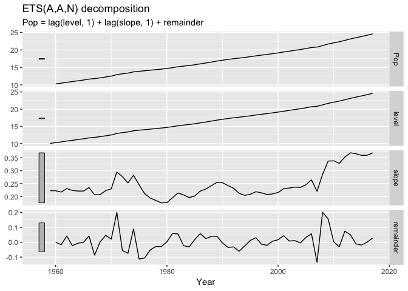
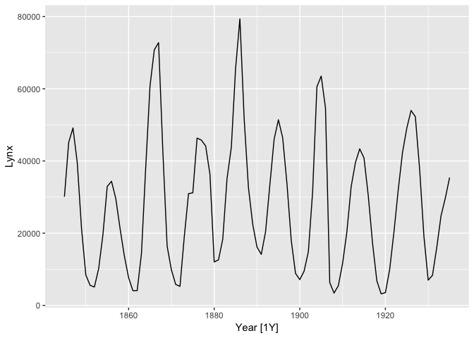

Lecture 7
================

``` r
library(fpp3)
```

    ## ── Attaching packages ─────────────────────── fpp3 0.1 ──

    ## ✔ tibble      2.1.1     ✔ tsibble     0.8.5
    ## ✔ dplyr       0.8.3     ✔ tsibbledata 0.1.0
    ## ✔ tidyr       1.0.0     ✔ feasts      0.1.2
    ## ✔ lubridate   1.7.4     ✔ fable       0.1.1
    ## ✔ ggplot2     3.1.1

    ## Warning: package 'fabletools' was built under R version 3.6.2

    ## ── Conflicts ────────────────────────── fpp3_conflicts ──
    ## ✖ lubridate::date()       masks base::date()
    ## ✖ dplyr::filter()         masks stats::filter()
    ## ✖ tsibble::id()           masks dplyr::id()
    ## ✖ tsibble::interval()     masks lubridate::interval()
    ## ✖ dplyr::lag()            masks stats::lag()
    ## ✖ tsibble::new_interval() masks lubridate::new_interval()

# Exponential smoothing

see pdf notes for details on additive and multiplicative models.

ETS(error, trend, season)

Each error, trend and season can be additive/multiplicative/none, or
damped.

``` r
aus_economy <- global_economy %>% 
  filter(Code == "AUS") %>% 
  mutate(Pop = Population/1e6)

fit <- aus_economy %>% 
  model(
    AAN = ETS(Pop)
  )

report(fit)
```

    ## Series: Pop 
    ## Model: ETS(A,A,N) 
    ##   Smoothing parameters:
    ##     alpha = 0.9999 
    ##     beta  = 0.3266366 
    ## 
    ##   Initial states:
    ##         l         b
    ##  10.05414 0.2224818
    ## 
    ##   sigma^2:  0.0041
    ## 
    ##       AIC      AICc       BIC 
    ## -76.98569 -75.83184 -66.68347

ETS(A,A,N) : A stands for “additive”, M for “multiplicative”, and N for
“none”. Damped is “Ad” or “Md” for additive and multiplicative
respectively.

\(\sigma^2\) is the variance of the residuals

``` r
components(fit)
```

    ## # A dable:                  59 x 7 [1Y]
    ## # Key:                      Country, .model [1]
    ## # ETS(A,A,N) Decomposition: Pop = lag(level, 1) + lag(slope, 1) +
    ## #   remainder
    ##    Country   .model  Year   Pop level slope  remainder
    ##    <fct>     <chr>  <dbl> <dbl> <dbl> <dbl>      <dbl>
    ##  1 Australia AAN     1959  NA    10.1 0.222  NA       
    ##  2 Australia AAN     1960  10.3  10.3 0.222  -0.000145
    ##  3 Australia AAN     1961  10.5  10.5 0.217  -0.0159  
    ##  4 Australia AAN     1962  10.7  10.7 0.231   0.0418  
    ##  5 Australia AAN     1963  11.0  11.0 0.223  -0.0229  
    ##  6 Australia AAN     1964  11.2  11.2 0.221  -0.00641 
    ##  7 Australia AAN     1965  11.4  11.4 0.221  -0.000314
    ##  8 Australia AAN     1966  11.7  11.7 0.235   0.0418  
    ##  9 Australia AAN     1967  11.8  11.8 0.206  -0.0869  
    ## 10 Australia AAN     1968  12.0  12.0 0.208   0.00350 
    ## # … with 49 more rows

``` r
components(fit) %>% autoplot()
```

    ## Warning: Removed 1 rows containing missing values (geom_path).

<!-- -->

``` r
fit %>% 
  forecast(h = 20) %>% 
  autoplot(aus_economy)
```

<!-- -->

Default chooses best (which is an AAN) in this case.

``` r
aus_economy %>% 
  model(
    mod = ETS(Pop)
  ) %>% 
  report()
```

    ## Series: Pop 
    ## Model: ETS(A,A,N) 
    ##   Smoothing parameters:
    ##     alpha = 0.9999 
    ##     beta  = 0.3266366 
    ## 
    ##   Initial states:
    ##         l         b
    ##  10.05414 0.2224818
    ## 
    ##   sigma^2:  0.0041
    ## 
    ##       AIC      AICc       BIC 
    ## -76.98569 -75.83184 -66.68347

A damped example: it’s leveling off.

``` r
fit <- aus_economy %>% 
  model(
    mod = ETS(Pop ~ trend("Ad"))
  ) 
report(fit)
```

    ## Series: Pop 
    ## Model: ETS(A,Ad,N) 
    ##   Smoothing parameters:
    ##     alpha = 0.9986305 
    ##     beta  = 0.4271838 
    ##     phi   = 0.98 
    ## 
    ##   Initial states:
    ##         l         b
    ##  10.03648 0.2478533
    ## 
    ##   sigma^2:  0.0045
    ## 
    ##       AIC      AICc       BIC 
    ## -71.01630 -69.36924 -58.65364

``` r
autoplot(forecast(fit, h = 20), aus_economy)
```

<!-- -->

An example with multiple series (and multiple models, best are selected
automatically).

``` r
fit <- global_economy %>% 
  mutate(pop = Population/1e6) %>% 
  model(ets = ETS(pop))
```

    ## Warning: 1 error encountered for ets
    ## [1] ETS does not support missing values.

``` r
fit  
```

    ## # A mable: 263 x 2
    ## # Key:     Country [263]
    ##    Country             ets         
    ##    <fct>               <model>     
    ##  1 Afghanistan         <ETS(A,A,N)>
    ##  2 Albania             <ETS(M,A,N)>
    ##  3 Algeria             <ETS(M,A,N)>
    ##  4 American Samoa      <ETS(M,A,N)>
    ##  5 Andorra             <ETS(M,A,N)>
    ##  6 Angola              <ETS(M,A,N)>
    ##  7 Antigua and Barbuda <ETS(M,A,N)>
    ##  8 Arab World          <ETS(M,A,N)>
    ##  9 Argentina           <ETS(A,A,N)>
    ## 10 Armenia             <ETS(M,A,N)>
    ## # … with 253 more rows

``` r
forecast(fit, h = 5)
```

    ## # A fable: 1,315 x 5 [1Y]
    ## # Key:     Country, .model [263]
    ##    Country     .model  Year   pop .distribution  
    ##    <fct>       <chr>  <dbl> <dbl> <dist>         
    ##  1 Afghanistan ets     2018 36.4  N(36, 0.012)   
    ##  2 Afghanistan ets     2019 37.3  N(37, 0.059)   
    ##  3 Afghanistan ets     2020 38.2  N(38, 0.164)   
    ##  4 Afghanistan ets     2021 39.0  N(39, 0.351)   
    ##  5 Afghanistan ets     2022 39.9  N(40, 0.644)   
    ##  6 Albania     ets     2018  2.87 N(2.9, 0.00012)
    ##  7 Albania     ets     2019  2.87 N(2.9, 0.00060)
    ##  8 Albania     ets     2020  2.87 N(2.9, 0.00169)
    ##  9 Albania     ets     2021  2.86 N(2.9, 0.00362)
    ## 10 Albania     ets     2022  2.86 N(2.9, 0.00664)
    ## # … with 1,305 more rows

# Lab session 14

Try foreasting Chinese GDP from global\_economy using an ETS model.

``` r
# calcualte gp per capita for china
china_gdp <- global_economy %>% 
  filter(Country == "China") 

autoplot(china_gdp, GDP)
```

<!-- -->

``` r
# fit ets model
china_gdp %>% 
  model(
    mod = ETS(GDP)
  ) %>% 
  forecast(h=10) %>% 
  autoplot(china_gdp)
```

<!-- -->

``` r
# try some transformations
fit <- china_gdp %>% 
  model(
    ets = ETS(GDP),
    ets_damped = ETS(GDP ~trend("Ad")),
    # box cox tranformation via Guerro is actually negative, 
    # but never use soemthing that low in practice
    ets_bc = ETS(box_cox(GDP, 0.2)),
    ets_log = ETS(log(GDP))
  ) 

fit  
```

    ## # A mable: 1 x 5
    ## # Key:     Country [1]
    ##   Country ets          ets_damped    ets_bc       ets_log     
    ##   <fct>   <model>      <model>       <model>      <model>     
    ## 1 China   <ETS(M,A,N)> <ETS(M,Ad,N)> <ETS(A,A,N)> <ETS(A,A,N)>

``` r
# ways to extract components
report(fit)
```

    ## Warning in report.mdl_df(fit): Model reporting is only supported for
    ## individual models, so a glance will be shown. To see the report for a
    ## specific model, use `select()` and `filter()` to identify a single model.

``` r
fit %>% select(ets) %>% report()
```

    ## Series: GDP 
    ## Model: ETS(M,A,N) 
    ##   Smoothing parameters:
    ##     alpha = 0.9998998 
    ##     beta  = 0.3119984 
    ## 
    ##   Initial states:
    ##            l          b
    ##  45713434615 3288256682
    ## 
    ##   sigma^2:  0.0108
    ## 
    ##      AIC     AICc      BIC 
    ## 3102.064 3103.218 3112.366

``` r
glance(fit)
```

    ## # A tibble: 4 x 10
    ##   Country .model  sigma2  log_ik     AIC    AICc     BIC      MSE     AMSE
    ##   <fct>   <chr>    <dbl>   <dbl>   <dbl>   <dbl>   <dbl>    <dbl>    <dbl>
    ## 1 China   ets    1.08e-2 -1546.   3102.   3103.   3112.  4.00e+22 1.61e+23
    ## 2 China   ets_d… 1.13e-2 -1547.   3105.   3107.   3117.  3.98e+22 1.59e+23
    ## 3 China   ets_bc 3.94e+2  -289.    588.    589.    598.  3.67e+ 2 1.32e+ 3
    ## 4 China   ets_l… 8.81e-3    21.5   -33.1   -31.9   -22.8 8.20e- 3 2.30e- 2
    ## # … with 1 more variable: MAE <dbl>

``` r
tidy(fit)
```

    ## # A tibble: 17 x 4
    ##    Country .model     term   estimate
    ##    <fct>   <chr>      <chr>     <dbl>
    ##  1 China   ets        alpha 10.00e- 1
    ##  2 China   ets        beta   3.12e- 1
    ##  3 China   ets        l      4.57e+10
    ##  4 China   ets        b      3.29e+ 9
    ##  5 China   ets_damped alpha 10.00e- 1
    ##  6 China   ets_damped beta   3.37e- 1
    ##  7 China   ets_damped phi    9.80e- 1
    ##  8 China   ets_damped l      4.57e+10
    ##  9 China   ets_damped b      3.29e+ 9
    ## 10 China   ets_bc     alpha 10.00e- 1
    ## 11 China   ets_bc     beta   3.85e- 1
    ## 12 China   ets_bc     l      7.07e+ 2
    ## 13 China   ets_bc     b      9.85e+ 0
    ## 14 China   ets_log    alpha 10.00e- 1
    ## 15 China   ets_log    beta   1.08e- 1
    ## 16 China   ets_log    l      2.48e+ 1
    ## 17 China   ets_log    b      4.32e- 2

``` r
coef(fit)
```

    ## # A tibble: 17 x 4
    ##    Country .model     term   estimate
    ##    <fct>   <chr>      <chr>     <dbl>
    ##  1 China   ets        alpha 10.00e- 1
    ##  2 China   ets        beta   3.12e- 1
    ##  3 China   ets        l      4.57e+10
    ##  4 China   ets        b      3.29e+ 9
    ##  5 China   ets_damped alpha 10.00e- 1
    ##  6 China   ets_damped beta   3.37e- 1
    ##  7 China   ets_damped phi    9.80e- 1
    ##  8 China   ets_damped l      4.57e+10
    ##  9 China   ets_damped b      3.29e+ 9
    ## 10 China   ets_bc     alpha 10.00e- 1
    ## 11 China   ets_bc     beta   3.85e- 1
    ## 12 China   ets_bc     l      7.07e+ 2
    ## 13 China   ets_bc     b      9.85e+ 0
    ## 14 China   ets_log    alpha 10.00e- 1
    ## 15 China   ets_log    beta   1.08e- 1
    ## 16 China   ets_log    l      2.48e+ 1
    ## 17 China   ets_log    b      4.32e- 2

``` r
fit %>% 
  forecast(h="20 years") %>% 
  autoplot(china_gdp, level = NULL)
```

<!-- -->

Example: Australian holiday tourism. Observe all the unique combinations
of models generated.

``` r
holidays <- tourism %>% 
  filter(Purpose == "Holiday")
fit <- model(holidays, mod = ETS(Trips))
fit %>% pull(mod)
```

    ##  [1] ETS(A,N,A) ETS(A,A,N) ETS(M,N,A) ETS(M,N,A) ETS(M,N,M) ETS(A,N,A)
    ##  [7] ETS(M,N,M) ETS(M,N,A) ETS(A,N,A) ETS(A,N,N) ETS(M,N,N) ETS(M,N,M)
    ## [13] ETS(A,A,N) ETS(A,N,A) ETS(M,N,A) ETS(A,N,N) ETS(M,N,M) ETS(M,N,A)
    ## [19] ETS(M,N,M) ETS(M,N,M) ETS(M,N,A) ETS(M,N,N) ETS(M,N,A) ETS(M,N,M)
    ## [25] ETS(A,N,A) ETS(M,N,A) ETS(M,N,A) ETS(M,N,A) ETS(M,N,A) ETS(A,N,A)
    ## [31] ETS(M,N,A) ETS(M,N,A) ETS(A,N,A) ETS(A,N,N) ETS(A,N,A) ETS(M,N,M)
    ## [37] ETS(M,N,A) ETS(M,N,M) ETS(M,A,A) ETS(M,A,A) ETS(M,N,A) ETS(M,N,A)
    ## [43] ETS(M,N,A) ETS(A,N,A) ETS(M,N,A) ETS(A,N,A) ETS(A,N,N) ETS(M,N,A)
    ## [49] ETS(A,N,A) ETS(M,A,A) ETS(M,N,M) ETS(A,N,N) ETS(M,N,M) ETS(M,N,M)
    ## [55] ETS(A,N,A) ETS(M,N,A) ETS(A,N,A) ETS(A,N,A) ETS(M,N,A) ETS(M,N,M)
    ## [61] ETS(M,N,A) ETS(M,N,M) ETS(A,N,A) ETS(M,N,A) ETS(M,N,M) ETS(M,N,N)
    ## [67] ETS(M,N,A) ETS(M,N,A) ETS(M,N,A) ETS(A,A,A) ETS(M,N,A) ETS(M,A,A)
    ## [73] ETS(M,N,M) ETS(M,N,M) ETS(A,A,N) ETS(M,N,A)

“Best” method chosen by AICc. See slide 39 of lecture 7. Paper for the
method of “automatic forecasting” using AICc.

**ETS won’t work well for data less than monthly level**.

# Lab session 15

Find an ETS model for the Gas data from aus\_prouduction

``` r
autoplot(aus_production, Gas)
```

<!-- -->

``` r
# needs a transformation
autoplot(aus_production, box_cox(Gas, 0.2))
```

<!-- -->

``` r
autoplot(aus_production, log(Gas))
```

<!-- -->

``` r
gas <- aus_production %>% 
  select(Gas) %>% 
  filter(Quarter <= yearquarter("2007 Q4")) 
```

    ## Selecting index: "Quarter"

``` r
autoplot(gas)
```

    ## Plot variable not specified, automatically selected `.vars = Gas`

<!-- -->

``` r
# fit models
fit <- gas %>% 
  model(
    auto = ETS(log(Gas)),
    damped = ETS(Gas ~ trend("Ad")),
    log = ETS(log(Gas))
  )

fit$auto    # AAA
```

    ## [1] ETS(A,A,A)

``` r
fit$damped  # M Ad M
```

    ## [1] ETS(M,Ad,M)

``` r
fit$log     # AAA
```

    ## [1] ETS(A,A,A)

``` r
fc <- fit %>% 
  forecast(h = "4 years")

fc %>% 
  autoplot(aus_production, level = NULL)
```

<!-- -->

``` r
# zoom in
fc %>% 
  autoplot(
    filter(
      aus_production, 
      Quarter > yearquarter("2000 Q4")),
    level = NULL)
```

<!-- -->

``` r
fc %>% 
  accuracy(aus_production)
```

    ## Warning: The future dataset is incomplete, incomplete out-of-sample data will be treated as missing. 
    ## 6 observations are missing between 2010 Q3 and 2011 Q4

    ## # A tibble: 3 x 9
    ##   .model .type    ME  RMSE   MAE   MPE  MAPE  MASE   ACF1
    ##   <chr>  <chr> <dbl> <dbl> <dbl> <dbl> <dbl> <dbl>  <dbl>
    ## 1 auto   Test  -7.82 10.1   8.44 -3.39  3.71  1.51 -0.134
    ## 2 damped Test  -6.17  8.17  7.00 -2.66  3.08  1.25 -0.264
    ## 3 log    Test  -7.82 10.1   8.44 -3.39  3.71  1.51 -0.134

``` r
glance(fit)
```

    ## # A tibble: 3 x 9
    ##   .model  sigma2 log_ik     AIC    AICc     BIC      MSE     AMSE    MAE
    ##   <chr>    <dbl>  <dbl>   <dbl>   <dbl>   <dbl>    <dbl>    <dbl>  <dbl>
    ## 1 auto   0.00331   43.0   -67.9   -67.0   -37.9  0.00318  0.00562 0.0421
    ## 2 damped 0.00341 -779.   1577.   1578.   1611.  20.6     32.1     0.0428
    ## 3 log    0.00331   43.0   -67.9   -67.0   -37.9  0.00318  0.00562 0.0421

``` r
# note that the log transformed distributions are transformed normal distributions.
# it applies a bias correction factor in the backtransformation automatically. =)
fc %>% filter(.model == "log") %>% pull(.distribution)
```

    ##  [1] t(N(5.3, 0.0033)) t(N(5.5, 0.0055)) t(N(5.5, 0.0081))
    ##  [4] t(N(5.4, 0.0114)) t(N(5.3, 0.0158)) t(N(5.5, 0.0202))
    ##  [7] t(N(5.6, 0.0254)) t(N(5.4, 0.0314)) t(N(5.3, 0.0389))
    ## [10] t(N(5.5, 0.0465)) t(N(5.6, 0.0550)) t(N(5.4, 0.0645))
    ## [13] t(N(5.3, 0.0760)) t(N(5.6, 0.0876)) t(N(5.6, 0.1002))
    ## [16] t(N(5.4, 0.1141))

# Non-Gaussian forecast distributions

If you don’t want to believe normality. For instance, forecasts are too
skewed (e.g. mean forecast not center of forecast distribution, or
residuals not normally distributed).

For non-Gaussian resduals, you can bootstrap with `generate()`. Although
this still assumed uncorrelated residuals. Can also do it within
`forecast()` with `bootstrap = TRUE`. 500 samples is default number of
samples, but you can changes this with `times = N`. See
`?forecast.ETS()`.

# Lab session

``` r
vc <- aus_retail %>% 
  filter(State == "Victoria",
         Industry == "Cafes, restaurants and catering services") %>% 
  select(Month, Turnover)

vc %>% autoplot(Turnover)
```

<!-- -->

``` r
# apply transformation to stabilize variance across time series
vc %>% autoplot(box_cox(Turnover, 0.2))
```

<!-- -->

``` r
# fit model
fit <- vc %>% 
  model(ets = ETS(box_cox(Turnover, 0.2)))

fit$ets 
```

    ## [1] ETS(A,A,A)

Bootstrapped forecast distributions

``` r
sim <- fit %>% generate(h = "3 years", times = 5, bootstrap = TRUE)
sim
```

    ## # A tsibble: 180 x 4 [1M]
    ## # Key:       .model, .rep [5]
    ##    .model  .rep    Month  .sim
    ##    <chr>  <int>    <mth> <dbl>
    ##  1 ets        1 2019 Jan  620.
    ##  2 ets        1 2019 Feb  542.
    ##  3 ets        1 2019 Mar  604.
    ##  4 ets        1 2019 Apr  648.
    ##  5 ets        1 2019 May  659.
    ##  6 ets        1 2019 Jun  628.
    ##  7 ets        1 2019 Jul  686.
    ##  8 ets        1 2019 Aug  685.
    ##  9 ets        1 2019 Sep  656.
    ## 10 ets        1 2019 Oct  692.
    ## # … with 170 more rows

``` r
vc %>% 
  filter(Month >= 2008) %>% 
  ggplot(aes(x=Month)) + 
  geom_line(aes(y = Turnover)) +
  geom_line(data = sim, aes(y = .sim, color = as.factor(.rep))) +
  guides(col = FALSE) +
  coord_cartesian(xlim = yearquarter(c(2010, 2023)),
                  ylim = c(300, 800))
```

<!-- -->

ETS handles trend, seasonality, but fails to handle cycles. For example:

``` r
pelt %>% autoplot(Lynx)
```

<!-- -->

``` r
# here's a lousy forecast
pelt %>% 
  model(ets = ETS(Lynx)) %>% 
  forecast(h="30 years") %>% 
  autoplot(pelt)
```

<!-- -->

``` r
# observe the model: error is Additive, trend is none, season is none. 
# ETS model doesn't know what to do with cyclic data without seasonality!
pelt %>% 
  model(ets = ETS(Lynx)) %>% 
  pull(ets)
```

    ## [1] ETS(A,N,N)
